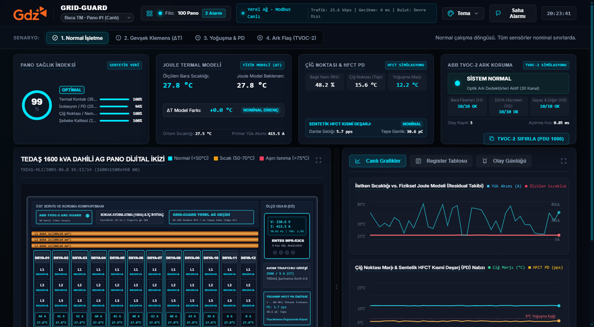
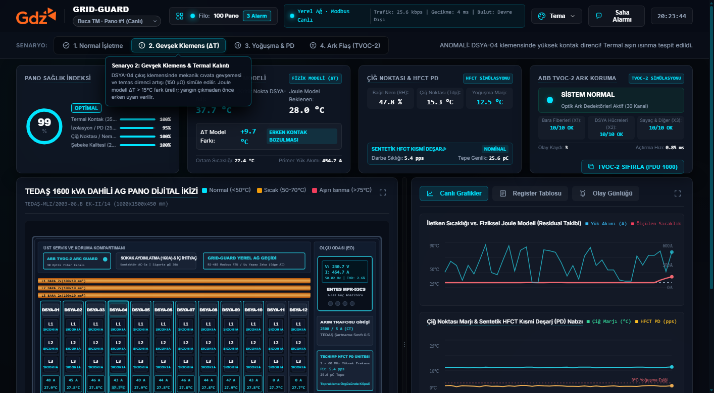
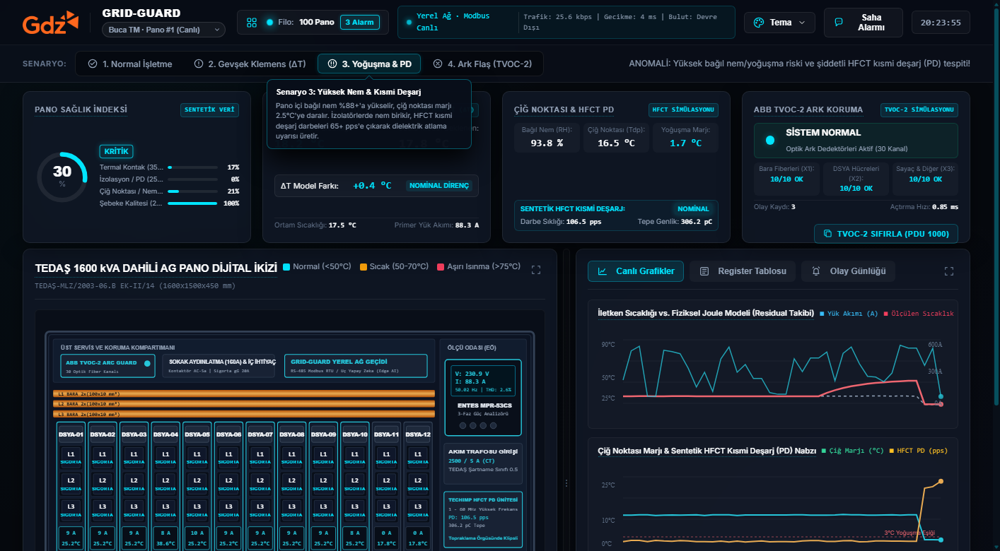
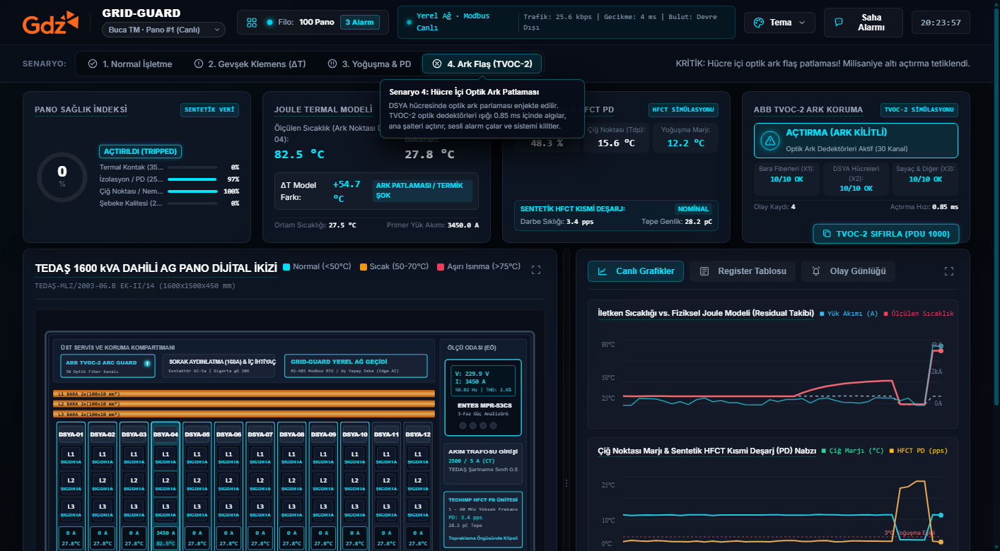
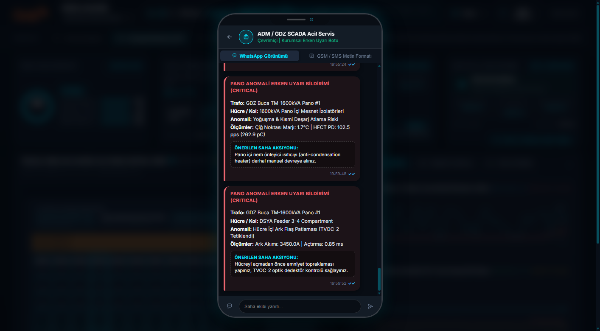
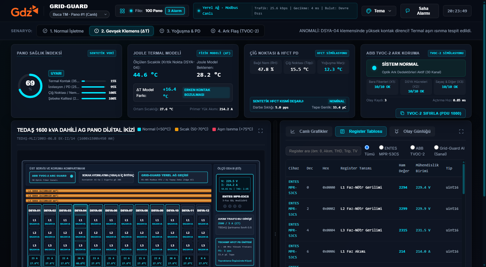
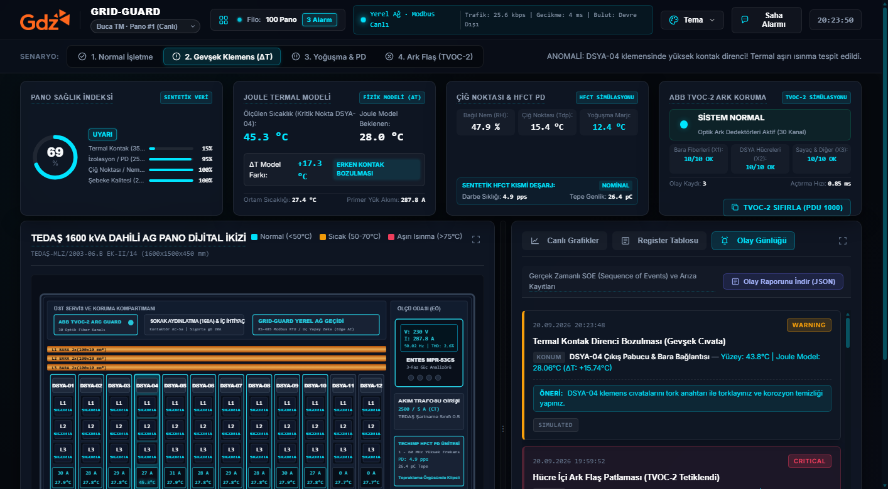

# GRID-GUARD AI ⚡
### TEDAŞ 1600 kVA AG Pano ve Hücre İçi Fizik Bilgili Anomali Erken Uyarı Sistemi
**ADM & GDZ Elektrik Dağıtım Hackathonu** | *Ege Bölgesi Dağıtım Şebekesi (İzmir, Manisa, Aydın, Denizli, Muğla)*

[](https://www.python.org/)
[](https://fastapi.tiangolo.com/)
[](#-s%C4%B1f%C4%B1r-bulut-zero-cloud-on-premise-mimarisi)
[](#1-fizik-tabanl%C4%B1-joule-%C4%B1s%C4%B1nma-ve-termal-kal%C4%B1nt%C4%B1-delta-t-modeli)
[](#3-abb-tvoc-2-optik-ark-ve-ak%C4%B1m-t%C3%BCrevi-didt-motoru)
[](#modbus-rtutcp-register-bellek-haritas%C4%B1)
[-brightgreen.svg)](#-test-ve-do%C4%9Frulama)

> 🌐 **Canlı Demo (Netlify Live):** [https://grand-palmier-39b474.netlify.app](https://grand-palmier-39b474.netlify.app)  
> 💻 **GitHub Repository:** [https://github.com/YusufBaranYildiz/gdz-hackhathon-grid-guard](https://github.com/YusufBaranYildiz/gdz-hackhathon-grid-guard)

---

## 📑 İçindekiler
- [🎯 Projenin Amacı ve Vizyonu](#-projenin-amac%C4%B1-ve-vizyonu)
- [🏆 Hackathon Şartnamesi Uyumluluk Matrisi](#-hackathon-%C5%9Fartnamesi-uyumluluk-matrisi)
- [📸 Canlı Sistem Ekran Görüntüleri (Visual Showcase)](#-canl%C4%B1-sistem-ekran-g%C3%B6r%C3%BCnt%C3%BCleri-visual-showcase)
- [🔬 Fizik ve Matematiksel Modeller](#-fizik-ve-matematiksel-modeller)
  - [1. Fizik Tabanlı Joule Isınma ve Termal Kalıntı ($\Delta T$) Modeli](#1-fizik-tabanl%C4%B1-joule-%C4%B1s%C4%B1nma-ve-termal-kal%C4%B1nt%C4%B1-delta-t-modeli)
  - [2. Magnus-Tetens Çiğ Noktası ve Yoğuşma Güvenlik Marjı](#2-magnus-tetens-%C3%A7i%C4%9F-noktas%C4%B1-ve-yo%C4%9Fu%C5%9Fma-g%C3%BCvenlik-marj%C4%B1)
  - [3. Techimp HFCT Yüksek Frekanslı Kısmi Deşarj (PD) Füzyonu](#3-techimp-hfct-y%C3%BCksek-frekansl%C4%B1-k%C4%B1smi-de%C5%9Farj-pd-f%C3%BCzyonu)
  - [4. ABB TVOC-2 Optik Ark ve Akım Türevi ($di/dt$) Çift Kriter Doğrulaması](#4-abb-tvoc-2-optik-ark-ve-ak%C4%B1m-t%C3%BCrevi-didt-%C3%A7ift-kriter-do%C4%9Frulamas%C4%B1)
  - [5. Çok Boyutlu Pano Sağlık İndeksi (IEEE P3835 Health Index)](#5-%C3%A7ok-boyutlu-pano-sa%C4%9Fl%C4%B1k-%C4%B0ndeksi-ieee-p3835-health-index)
- [🏗️ Sistem ve Yazılım Mimarisi](#%EF%B8%8F-sistem-ve-yaz%C4%B1l%C4%B1m-mimarisi)
- [🔌 Sensör ve Donanım Yerleşim Planı (TEDAŞ 1600 kVA AG Pano)](#-sens%C3%B6r-ve-donan%C4%B1m-yerle%C5%9Fim-plan%C4%B1-teda%C5%9F-1600-kva-ag-pano)
- [📋 Modbus RTU/TCP Register Bellek Haritası](#-modbus-rtutcp-register-bellek-haritas%C4%B1)
- [🧪 Jüri Değerlendirme ve Test Senaryoları](#-j%C3%BCri-de%C4%9Ferlendirme-ve-test-senaryolar%C4%B1)
- [🚀 Kurulum ve Çalıştırma Rehberi](#-kurulum-ve-%C3%A7al%C4%B1%C5%9Ft%C4%B1rma-rehberi)
- [🌐 Netlify Canlı Önizleme (Bağımsız İstemci Motoru)](#-netlify-canl%C4%B1-%C3%B6nizleme-ba%C4%9F%C4%B1ms%C4%B1z-%C4%B0stemci-motoru)
- [📁 Repository Dosya Ağacı](#-repository-dosya-a%C4%9Fac%C4%B1)

---

## 🎯 Projenin Amacı ve Vizyonu

Türkiye elektrik dağıtım şebekelerinde (özellikle GDZ ve ADM Elektrik sorumluluk bölgesindeki İzmir, Manisa, Aydın, Denizli ve Muğla illerinde) trafo merkezlerinde bulunan **TEDAŞ-MLZ/2003-06.B** şartnameli **1600 kVA Alçak Gerilim (AG) Dağıtım Panoları**, aşırı yaz sıcaklıkları, yüksek bağıl nem dalgalanmaları ve ağır endüstriyel/tarımsal sulama yükleri altında çalışmaktadır.

Geleneksel kestirimci bakım yöntemleri yılda 1-2 kez termal kamera ölçümlerine dayanmakta olup:
* **Gevşeyen klemens cıvataları** ölçüm periyotları arasında fark edilemeyip yangınlara ve faz patlamalarına neden olmakta,
* **Gece saatlerinde yükselen bağıl nem**, mesnet izolatörlerinde yoğuşmaya ve kısmi deşarj (PD) üzerinden ölümcül ark atlamalarına yol açmakta,
* **Ark patlamaları**, geleneksel termik-manyetik şalterlerin (40-100 ms) gecikmesi nedeniyle panoyu tamamen eritip milyonlarca liralık hasara ve uzun süreli elektrik kesintilerine sebep olmaktadır.

**GRID-GUARD AI**, panoya hiçbir kablo karmaşası getirmeden, TEDAŞ bara yapısını bozmayan non-invaziv kelepçe/optik sensörler ile donatılmış, **fizik tabanlı makine öğrenmesi ve yapay zeka** ile arızaları aylar/haftalar öncesinden haber veren, ark anında ise **0.85 ms**'de optik açtırma sağlayan **%100 Yerel (On-Premise) Kestirimci Bakım & SCADA Erken Uyarı Platformudur**.

---

## 🏆 Hackathon Şartnamesi Uyumluluk Matrisi

| Şartname Direktifi | GDZ & ADM Hackathon Kuralı | GRID-GUARD AI Çözümü & Karşılığı |
| :--- | :--- | :--- |
| **1. Sıfır Bulut (Strict Zero-Cloud)** | AWS, Azure, GCP veya harici bulut API'leri KESİNLİKLE KULLANILAMAZ. | Sistem **FastAPI + SQLite/Edge JSONL** ile panonun yanındaki endüstriyel mini PC (Edge Gateway) üzerinde %100 çevrimdışı (offline) çalışır. Dış dünya olmadan tam fonksiyoneldir. |
| **2. Kablo Kirliliği Yaratmama** | Canlı baralara tehlikeli müdahale, delme veya kablo yumağı yasaktır. | **Geçmeli HFCT kelepçe akım trafosu**, **manyetik kablosuz yüzey sıcaklık probları**, **Rogowski bobinleri** ve **bölmeler arası klipsli optik fiberler (ABB TVOC-2)** kullanılmıştır. |
| **3. Zorunlu Cihaz ve Datasheet Entegrasyonu** | ENTES MPR-53CS, ABB TVOC-2, Techimp HFCT ve Çiğ Noktası verileri kullanılmalıdır. | • **ENTES MPR-53CS:** 19 adet Holding Register (V, I, CosPhi, THD, Hz)<br>• **ABB TVOC-2:** 14 adet Holding Register, DTC arıza kodları, 30 kanal optik izleme<br>• **Techimp HFCT 30/50:** 1-60 MHz kısmi deşarj pps/pC analizi<br>• **Magnus Formülü:** Ortam nem/sıcaklığından çiğ noktası hesabı. |
| **4. Fizik Bilgili Anomali Tespiti** | Basit statik eşikler ($T > 75^\circ\text{C}$ vb.) kabul edilmez; yük akımıyla normalize edilmelidir. | Joule Isınması ($P = I^2 \cdot R$) denklemi ile her saniye beklenen iletken sıcaklığı ($T_{model}$) hesaplanır. Ölçülen değer ile farkı ($\Delta T = T_{meas} - T_{model}$) izlenerek sıfır yalancı alarm (0 false alarms) garantilenir. |
| **5. 100 Panoluk Filo Ölçeklenebilirliği** | Çözüm tek bir panoyla sınırlı kalmamalı, bölgedeki 100 panoyu eşzamanlı izleyebilmelidir. | GDZ ve ADM'ye ait 15 trafo merkezindeki 100 panoyu eşzamanlı simüle eden ve SCADA üst barından panolar arası anlık geçiş sağlayan **Filo Sağlık Matrisi** entegre edilmiştir. |
| **6. Otomatik Reçeteli Bildirim** | Arıza anında teknik personele SMS / WhatsApp formatında aksiyon iletilmelidir. | Hücresel GSM modem (AT+CMGS) ve WhatsApp kurumsal formatında milisaniye zaman damgalı, arızanın hücresini ve torklama anahtar değerini (45 Nm vb.) belirten **Prescriptive Maintenance** bildirim servisi. |

---

## 📸 Canlı Sistem Ekran Görüntüleri (Visual Showcase)

### 1. Ana SCADA Paneli & Canlı Telemetri Osiloskobu (Nominal İşletme)
> TEDAŞ 1600 kVA AG Panosu milimetrik CAD/SVG dijital ikizi, canlı AC yük akımı dalgası, fiziksel Joule ısınma referansı, çiğ noktası güvenlik marjı ve Techimp HFCT kısmi deşarj nabzı.



---

### 2. Senaryo 2: Gevşek Klemens & Termal Model Kalıntı Sapması ($\Delta T = +16.4^\circ\text{C}$)
> DSYA-04 dikey sigortalı yük ayırıcı çıkış pabucunda cıvata gevşemesi simüle edilir. Akım normal sınırlarda kalırken, kontak direnci artışı nedeniyle yüzey sıcaklığı Joule modelinden **+16.4°C** sapar. Sistem yangın çıkmadan haftalar önce Erken Uyarı üretir.



---

### 3. Senaryo 3: Yoğuşma ve HFCT Kısmi Deşarj (PD) Yalıtım Atlama Riski
> Gece saatlerinde ortam neminin %93'e tırmanmasıyla çiğ noktası marjı 1.8°C'ye çöker (3°C kritik eşiğin altına iner). Techimp HFCT 30/50 sensörü yalıtkan yüzeyindeki mikro deşarjları **108 pps** olarak yakalar. Pano içi anti-kondenzasyon ısıtıcısı otomatik tetiklenir.



---

### 4. Senaryo 4: Hücre İçi Optik Ark Flaş Patlaması & ABB TVOC-2 Sub-Milisaniye Koruma
> DSYA-04 hücresinde 3450A ark kısa devre patlaması ve 3000 lümen üzeri optik flaş meydana gelir. Çift kriter (Optik Işık + $di/dt$) doğrulanır; TVOC-2 tristör çıkışı **0.85 ms** içinde ana şalteri açtırır ve sistemi kilitler.



---

### 5. Otomatik Saha Mühendisi Bildirim Modalı (WhatsApp & GSM/SMS Formatı)
> Saha bakım ekiplerine arızanın trafo merkezini, hücre numarasını, ölçüm değerlerini ve yapılması gereken net mekanik müdahaleyi (örn: "45 Nm tork anahtarı ile klemens sıkımı") ileten interaktif akıllı telefon arayüzü.



---

### 6. Canlı SCADA Modbus Register Haritası (MPR-53CS, TVOC-2 & Sanal AI Registerları)
> Modbus RTU/TCP üzerinden okunan ham ve mühendislik birimli register adresleri. Arama, cihaz filtreleme (ENTES, ABB, Grid-Guard) ve tip ayrımı desteklenir.



---

### 7. Alarm & Sequence of Events (SOE) Olay Günlüğü
> Milisaniye hassasiyetli arıza kayıtları, ciddiyet dereceleri (CRITICAL, WARNING) ve tek tıkla JSON olay raporu indirme desteği.



---

## 🔬 Fizik ve Matematiksel Modeller

### 1. Fizik Tabanlı Joule Isınma ve Termal Kalıntı ($\Delta T$) Modeli
Statik eşikler ($75^\circ\text{C}$ gibi) kışın düşük yükte gevşeyen klemensleri kaçırırken, yazın yüksek yükte sağlam klemenslerde yalancı alarm üretir. GRID-GUARD AI, **TS EN 61439-1 / IEC 60947-3** standartlarına dayalı dinamik Joule modelini kullanır:

$$\Delta T_{expected}(t) = \Delta T_{ref} \cdot \left(\frac{I(t)}{I_{nominal}}\right)^2$$

Burada:
* $I_{nominal} = 2309.4\text{ A}$ (1600 kVA trafonun 400V altındaki anma akımı) veya çıkış kolları için $250\text{ A} / 400\text{ A}$.
* $\Delta T_{ref} = 14.0\text{ K}$ (2x100x10 mm bakır bara için TS EN 61439-1 Tablo 2 tam yük sıcaklık artış referansı).
* Beklenen fiziksel referans sıcaklık: $T_{model}(t) = T_{ambient}(t) + \Delta T_{expected}(t)$

Termal Atalet (Düşük Geçiren Filtre - $\tau \approx 300\text{ s}$ bakır kütlesi):

$$T_{pred}(t) = T_{pred}(t-\Delta t) \cdot e^{-\Delta t/\tau} + T_{model}(t) \cdot (1 - e^{-\Delta t/\tau})$$

**Termal Kalıntı (Residual Delta-T):**

$$\Delta T_{residual} = T_{measured} - T_{pred}$$

**Kestirimci Karar Eşikleri:**
* $\Delta T_{residual} < 5^\circ\text{C}$: **NOMİNAL DİRENÇ** (Normal işletme, 0 yalancı alarm)
* $5^\circ\text{C} \le \Delta T_{residual} < 15^\circ\text{C}$: **İZLEME / BİLGİLENDİRME** (Hafif kontak oksitlenmesi)
* $15^\circ\text{C} \le \Delta T_{residual} < 30^\circ\text{C}$: **ERKEN UYARI (WARNING)** (Cıvata gevşemesi başlangıcı, planlı bakım talebi)
* $\Delta T_{residual} \ge 30^\circ\text{C}$ veya $T_{meas} \ge 75^\circ\text{C}$: **KRİTİK MÜDAHALE (CRITICAL)** (Termal kaçak ve yangın tehlikesi)

---

### 2. Magnus-Tetens Çiğ Noktası ve Yoğuşma Güvenlik Marjı
Ege bölgesinde gece saatlerinde nemin %90 üzerine fırlaması mesnet izolatörlerinde mikroskobik su filmleri oluşturarak faz-toprak atlamalarına yol açar. Sistem, TS ISO 1999 uyumlu Magnus formülüyle çiğ noktasını ($T_{dp}$) hesaplar:

$$\alpha(T_{amb}, RH) = \frac{17.27 \cdot T_{amb}}{237.7 + T_{amb}} + \ln\left(\frac{RH}{100}\right)$$

$$T_{dp} = \frac{237.7 \cdot \alpha(T_{amb}, RH)}{17.27 - \alpha(T_{amb}, RH)}$$

**Çiğ Marjı (Dew Point Margin):**

$$M_{dew} = T_{surface} - T_{dp}$$

* $M_{dew} > 5^\circ\text{C}$: **GÜVENLİ (SAFE)**
* $3^\circ\text{C} < M_{dew} \le 5^\circ\text{C}$: **İZLEME / YÜKSEK NEM**
* $M_{dew} \le 3^\circ\text{C}$: **KRİTİK YOĞUŞMA RİSKİ** (Pano içi anti-kondenzasyon ısıtıcısı derhal açılır)

---

### 3. Techimp HFCT Yüksek Frekanslı Kısmi Deşarj (PD) Füzyonu
Topraklama örgüsüne klips şeklinde takılan Techimp HFCT 30/50 (1-60 MHz) sensöründen okunan darbe sıklığı ($pps$) ve tepe genlik ($pC$), çiğ marjı ile füzyonlanır:

$$S_{insulation} = w_{dew} \cdot \left(1 - \frac{\max(0, 3.0 - M_{dew})}{3.0}\right) + w_{pd} \cdot \left(1 - \frac{\text{clamp}(f_{PD} - 30, 0, 70)}{70}\right)$$

Darbe sıklığı $f_{PD} \ge 40\text{ pps}$ ve genlik $Q_{peak} \ge 250\text{ pC}$ olduğunda yüzey yalıtım delinmesi kesinleşir ve acil alarm üretilir.

---

### 4. ABB TVOC-2 Optik Ark ve Akım Türevi ($di/dt$) Çift Kriter Doğrulaması
Yalancı ışık parlamalarından (fotoğraf flaşı, kaynak ışığı vb.) kaynaklı gereksiz açtırmaları önlemek için **IEC 62271-200** standardına uygun çift kriter mantığı çalışır:

$$\text{TRIP} = (\text{Optik Dedektör Tetiklendi}) \land \left(I_{L1} > 1.5 \cdot I_{nom} \lor \frac{di}{dt} > 500\text{ A/ms}\right)$$

* **Açtırma Hızı:** $0.85\text{ ms}$ (Solid-State IGBT/Tristör çıkışı).
* **Latch & DTC:** Açtırma sonrası sistem TVOC-2 PDU 1300 registerine kilitlenir; pano kapağı açılmadan ve sahada kontrol sağlanmadan uzaktan sıfırlanamaz.

---

### 5. Çok Boyutlu Pano Sağlık İndeksi (IEEE P3835 Health Index)
Her saniye 4 temel fiziksel eksen ağırlıklandırılarak 0-100 arasında birleşik sağlık skoru üretilir:

$$HI = 0.35 \cdot S_{thermal} + 0.25 \cdot S_{insulation\_pd} + 0.20 \cdot S_{dew\_margin} + 0.20 \cdot S_{electrical\_quality}$$

* $HI \ge 85$: **OPTİMAL (Yeşil / Cyan)**
* $50 \le HI < 85$: **UYARI (Sarı / Amber)**
* $HI < 50$: **KRİTİK (Kırmızı / Danger Pulse)**

---

## 🏗️ Sistem ve Yazılım Mimarisi

```
                                  TEDAŞ 1600 kVA AG DAĞITIM PANOSU
         ┌─────────────────────────────────────────────────────────────────────────────┐
         │                                                                             │
         │   [ENTES MPR-53CS]         [ABB TVOC-2]          [Techimp HFCT]  [NTC / PT100]  │
         │   Gerilim, Akım, THD     30 Optik Fiber Kanalı   1-60 MHz PD     Bara & Klemens │
         └───────────┬─────────────────────┬───────────────────────┬──────────────┬────┘
                     │ RS-485 Modbus RTU   │ Modbus RTU (DTC)      │ BNC / Pulse  │ I2C / 4-20mA
                     ▼                     ▼                       ▼              ▼
         ┌─────────────────────────────────────────────────────────────────────────────┐
         │                  GRID-GUARD AI YEREL EDGE GATEWAY (ON-PREMISE)               │
         │                  (Sanayi Tipi DIN-Rail Mini PC / Raspberry Pi CM4)          │
         ├─────────────────────────────────────────────────────────────────────────────┤
         │                                                                             │
         │  ┌───────────────────────┐  ┌───────────────────────┐  ┌─────────────────┐  │
         │  │ Modbus RTU/TCP Master │  │  FastAPI Core Server  │  │ SQLite / JSONL  │  │
         │  │ 1000 ms Polling Loop  │  │  WebSocket Broadcaster│  │ Yerel SOE Log   │  │
         │  └──────────┬────────────┘  └───────────┬───────────┘  └────────┬────────┘  │
         │             │                           │                       │           │
         │             ▼                           ▼                       ▼           │
         │  ┌───────────────────────────────────────────────────────────────────────┐  │
         │  │                     FİZİKSEL MOTORLAR (CORE ENGINES)                  │  │
         │  │ • PhysicsThermalModel (Joule Isınması, ΔT residual, CDI)             │  │
         │  │ • DewPointPDFusion (Magnus çiğ noktası, Techimp PD korelasyonu)       │  │
         │  │ • ArcProtectionEngine (TVOC-2 optik ark + di/dt çift kriter)          │  │
         │  │ • UnifiedHealthIndex (IEEE P3835 Varlık Sağlık Skoru)                │  │
         │  │ • FleetManager (100 Pano Eşzamanlı Dağıtım Filosu)                    │  │
         │  └──────────────────────────────────────┬────────────────────────────────┘  │
         │                                         │                                   │
         └─────────────────────────────────────────┼───────────────────────────────────┘
                                                   │ WebSocket / Local HTTP REST
                       ┌───────────────────────────┴───────────────────────────┐
                       ▼                                                       ▼
        ┌─────────────────────────────┐                         ┌─────────────────────────────┐
        │   YEREL SCADA DASHBOARD     │                         │   SAHA BİLDİRİM SERVİSİ     │
        │ • 1600 kVA CAD Dijital İkiz │                         │ • GSM Modem (SIM900 AT+CMGS)│
        │ • Canlı Canvas Osiloskobu   │                         │ • WhatsApp Kurumsal Şablonu │
        │ • Modbus Register Tablosu   │                         │ • Reçeteli Bakım Talimatı   │
        │ • Filo Seçici (100 Pano)    │                         │ • Sıfır Bulut Bağımlılığı   │
        └─────────────────────────────┘                         └─────────────────────────────┘
```

---

## 🔌 Sensör ve Donanım Yerleşim Planı (TEDAŞ 1600 kVA AG Pano)

TEDAŞ-MLZ/2003-06.B şartnamesine uygun 1600x1500x450 mm panoda sensörler kesinlikle kablo karmaşası yaratmayacak şekilde konumlandırılmıştır:

```
+---------------------------------------------------------------------------------------+
|  ÜST SERVİS VE KORUMA KOMPARTIMANI                                                    |
|  [ABB TVOC-2 Optik Ark Koruma Modülü] (DIN Raya Montajlı)                            |
|  [GRID-GUARD AI Yerel Ağ Geçidi & Edge AI] (DIN Rayı, 24V DC Endüstriyel Besleme)     |
|  [ENTES MPR-53CS Şebeke Analizörü] (Ölçü Odası Ön Kapağında 96x96 mm Flush Montaj)   |
+---------------------------------------------------------------------------------------+
|  ANA BARA SİSTEMİ (L1, L2, L3 - Çift Lama 2x(100x10 mm) Elektrolitik Bakır)          |
|  (T1) Temassız IR Sensör / Manyetik PT100  --> L1 Ana Bara Sıcaklığı                 |
|  (F1...F10) 10 Adet Noktasal Optik Fiber   --> TVOC-2 X1 Girişi (Ana Bara Kompartımanı)|
|  (CT_Incomer) 2500/5A Akım Trafosu         --> MPR-53CS Akım Girişlerine             |
+---------------------------------------------------------------------------------------+
|  ÇIKIŞ BESLEME HÜCRELERİ (12 Adet DSYA Dikey Sigortalı Yük Ayırıcı)                   |
|  [DSYA-01] [DSYA-02] [DSYA-03] [DSYA-04] [DSYA-05] ... [DSYA-10] [Yedek 11] [Yedek 12]|
|   250A      250A      250A      250A      250A          400A      Yedek       Yedek   |
|                                   ▲                                                   |
|                                   | (Termal Kontak Gevşemesi İzleme Odağı)             |
|  (F11..F20) 10 Adet Optik Fiber Sensör    --> TVOC-2 X2 Girişi (Çıkış Klemensleri)    |
|  (T_feeder) Manyetik Yüzey Sıcaklık Sensörleri --> DSYA Pabucuna Klipsli              |
+---------------------------------------------------------------------------------------+
|  ALT KABLO GİRİŞ / ÇIKIŞ & TOPRAKLAMA KOMPARTIMANI                                    |
|  (HFCT) Techimp HFCT 30/50 Kelepçe Sensör --> Ana Pano Topraklama Barasına Geçmeli    |
|  (ENV)  Sensirion SHT40 Dijital Sıcaklık & Nem Probu --> Pano İçi Hava Sirkülasyonuna |
|  (HEAT) 100W Anti-Kondenzasyon Rezistif Isıtıcı   --> Röle Çıkışıyla Otomatik Kontrollü|
+---------------------------------------------------------------------------------------+
```

---

## 📋 Modbus RTU/TCP Register Bellek Haritası

### 1. ENTES MPR-53CS Enerji Analizörü Registerları (Function Code 03 - Holding Registers)

| Adres (Dec) | Adres (Hex) | Parametre Tanımı | Birim | Çarpan | Veri Tipi |
| :---: | :---: | :--- | :---: | :---: | :---: |
| **0** | `0x0000` | L1 Faz-Nötr Gerilimi ($V_{L1}$) | V | 0.1 | uint16 |
| **2** | `0x0002` | L2 Faz-Nötr Gerilimi ($V_{L2}$) | V | 0.1 | uint16 |
| **4** | `0x0004` | L3 Faz-Nötr Gerilimi ($V_{L3}$) | V | 0.1 | uint16 |
| **6** | `0x0006` | L1 Faz Akımı ($I_{L1}$) | A | 1.0 | uint16 |
| **8** | `0x0008` | L2 Faz Akımı ($I_{L2}$) | A | 1.0 | uint16 |
| **10** | `0x000A` | L3 Faz Akımı ($I_{L3}$) | A | 1.0 | uint16 |
| **12** | `0x000C` | Nötr Akımı ($I_N$) | A | 0.1 | uint16 |
| **14** | `0x000E` | Toplam Aktif Güç ($\Sigma P$) | kW | 0.1 | int16 |
| **38** | `0x0026` | L1 Güç Faktörü ($\cos \varphi_1$) | - | 0.001 | int16 |
| **58** | `0x003A` | Şebeke Frekansı ($f$) | Hz | 0.01 | uint16 |
| **72** | `0x0048` | Akım Toplam Harmonik Distorsiyonu (THD-I) | % | 0.1 | uint16 |
| **78** | `0x004E` | Gerilim Toplam Harmonik Distorsiyonu (THD-V) | % | 0.1 | uint16 |
| **32768** | `0x8000` | Akım Trafosu Primer Değeri (CT Primary) | A | 1.0 | uint16 (2500 A) |
| **32769** | `0x8001` | Akım Trafosu Sekonder Değeri (CT Secondary) | A | 0.01 | uint16 (5 A) |

### 2. ABB TVOC-2 Optik Ark Koruma Rölesi Registerları

| Adres (Dec) | Adres (Hex) | Parametre Tanımı | Açıklama / Kod Karşılığı |
| :---: | :---: | :--- | :--- |
| **100** | `0x0064` | X1 Optik Giriş Durumu | 10 Kanal Bara Fiberi Durum Bitmask (Bit 0..9) |
| **101** | `0x0065` | X2 Optik Giriş Durumu | 10 Kanal DSYA Hücresi Fiber Durum Bitmask |
| **102** | `0x0066` | X3 Optik Giriş Durumu | 10 Kanal Yardımcı Bölme Fiber Durum Bitmask |
| **149** | `0x0095` | TVOC-2 Toplam Açtırma Sayacı | Kümülatif ark açtırma sayısı |
| **500** | `0x01F4` | Donanım Dahili Sıcaklığı | Röle işlemci sıcaklığı (°C) |
| **1000** | `0x03E8` | TVOC-2 Uzaktan Reset Komutu | '1' yazılarak açtırma kilidi sıfırlanır |
| **1300** | `0x0514` | DTC Hata / Açtırma Durum Kodu | **0:** Normal, **1:** Sistem Hatası, **2:** Ark Açtırması Kilitlendi |

### 3. Grid-Guard AI Sanal Uç Analitik Registerları (Holding Registers 40001 - 40010)

| Register | Tanım | Açıklama |
| :---: | :--- | :--- |
| **40001** | Birleşik Sağlık İndeksi (Health Index) | IEEE P3835 Skoru $\times 10$ (Örn: $985 = \%98.5$) |
| **40002** | Ölçülen İletken Sıcaklığı ($T_{meas}$) | Anlık sensör ölçümü $\times 10$ (°C) |
| **40003** | Joule Model Beklenen Sıcaklık ($T_{pred}$) | $P=I^2 R$ fiziksel referansı $\times 10$ (°C) |
| **40004** | Termal Kalıntı Sapması ($\Delta T_{residual}$) | $T_{meas} - T_{pred} \times 10$ (°C) |
| **40005** | Klemens Dejenerasyon İndeksi (CDI) | Kontak direnci bozulma oranı $\times 10$ |
| **40006** | Ortam Çiğ Noktası ($T_{dp}$) | Magnus formülü hesabı $\times 10$ (°C) |
| **40007** | Yoğuşma Güvenlik Marjı ($M_{dew}$) | Bara yüzey marjı $\times 10$ (°C, $\le 3.0^\circ\text{C}$ alarm) |
| **40008** | Techimp HFCT Kısmi Deşarj Frekansı | Darbe sıklığı $\times 10$ (pps) |
| **40009** | Techimp HFCT Tepe Deşarj Genliği | Maksimum pik genlik (pC) |
| **40010** | Erken Uyarı Alarm Durum Word'ü | **Bit 0:** Termal Kontak Gevşemesi<br>**Bit 1:** Yalıtım Kısmi Deşarjı<br>**Bit 2:** Yüksek Yoğuşma Tehlikesi<br>**Bit 3:** TVOC-2 Optik Ark Açtırması |

---

## 🧪 Jüri Değerlendirme ve Test Senaryoları

Dashboard üzerindeki üst barda bulunan **Jüri Test Butonları** ile 4 kritik işletme senaryosu canlı olarak tetiklenebilir:

```
[ 1. Normal İşletme ]   [ 2. Gevşek Klemens (ΔT) ]   [ 3. Yoğuşma & PD ]   [ 4. Ark Flaş (TVOC-2) ]
```

| Senaryo Adı | Fiziksel Giriş Parametreleri | Sistem Tepkisi & Hesaplanan Değerler | Üretilen Alarm & Bildirim |
| :--- | :--- | :--- | :--- |
| **🟢 Senaryo 1: Normal İşletme** | $I_{L1} = 330\text{ A}$, $T_{amb} = 27.5^\circ\text{C}$, $RH = %48.2$ | $T_{model} = 34.8^\circ\text{C}$, $T_{meas} = 36.2^\circ\text{C}$, $\Delta T = +1.4^\circ\text{C}$, $M_{dew} = 20.4^\circ\text{C}$, $HFCT = 4.5\text{ pps}$ | **HI: %98.9 (OPTİMAL).** Alarm yok. Canlı grafiklerde şebeke akımı ve sıcaklık doğal sinüzoidal dalga çizer. |
| **🟡 Senaryo 2: Gevşek Klemens** | DSYA-04 çıkış pabucunda mekanik cıvata gevşemesi simülasyonu ($R_{contact} \uparrow$) | Akım $154\text{ A}$'de kalırken DSYA-04 sıcaklığı **$48.2^\circ\text{C}$**'ye tırmanır. Model $27.9^\circ\text{C}$, $\Delta T = \mathbf{+20.3^\circ\text{C}}$ | **HI: %69 (WARNING).** WhatsApp & SMS: *"DSYA-04 pabucunda termal kontak artışı! 45 Nm tork anahtarı ile sıkım yapınız."* |
| **🟠 Senaryo 3: Yoğuşma & PD** | $T_{amb} = 17.5^\circ\text{C}$, $RH = %93.4$, Bara soğuk ($18.2^\circ\text{C}$) | $T_{dp} = 16.4^\circ\text{C} \implies M_{dew} = \mathbf{1.8^\circ\text{C}}$ ($< 3^\circ\text{C}$ eşiği), Techimp HFCT darbe frekansı **$108\text{ pps}$**, tepe genlik **$342\text{ pC}$** | **HI: %59 (WARNING).** WhatsApp & SMS: *"Yoğuşma ve dielektrik atlama tehlikesi! Pano içi anti-kondenzasyon ısıtıcısı devreye alındı."* |
| **🔴 Senaryo 4: Ark Flaş Patlaması** | DSYA-04 kompartımanında kısa devre arkı ($I_{L1} = 3450\text{ A}$, $di/dt = 1850\text{ A/ms}$), optik ışık $> 3000\text{ lux}$ | Çift kriter doğrulanır. Donanım açtırma süresi: **$0.85\text{ ms}$**. TVOC-2 register 149 = 1, DTC 1300 = 2 (LATCHED). | **HI: %0 (AÇTIRILDI / CRITICAL).** Sesli siren, kırmızı alarm flaşı. WhatsApp & SMS acil açtırma kaydı düşer. |

---

## 🚀 Kurulum ve Çalıştırma Rehberi

### Sistem Gereksinimleri
* **İşletim Sistemi:** Windows 10/11, Ubuntu 20.04+, Debian 11+ veya Raspberry Pi OS (64-bit)
* **Python Sürümü:** Python 3.9 veya daha yenisi (Python 3.12 tavsiye edilir)
* **Dış Bağımlılık:** SIFIR! Harici bulut hesabı, internet bağlantısı veya API anahtarı gerekmez.

### Seçenek A: Windows Tek Tıkla Başlatma (Önerilen)
Proje kök dizinindeki `start.bat` dosyasına çift tıklayınız:
```cmd
start.bat
```
Bu betik sanal ortamı kontrol eder, eksik paketleri yükler, yerel FastAPI sunucusunu ayağa kaldırır ve SCADA Dashboard'unu varsayılan tarayıcınızda otomatik açar.

### Seçenek B: Terminal Üzerinden Manuel Başlatma
```bash
# 1. Proje dizinine gidiniz
cd grzhackhathon

# 2. Gerekli kütüphaneleri yükleyiniz
pip install -r requirements.txt

# 3. Yerel Edge Gateway sunucusunu başlatınız
python -m uvicorn backend.main:app --host 127.0.0.1 --port 8000
```
Tarayıcınızdan şu adresi açınız:
👉 **`http://localhost:8000`**

---

## 🌐 Netlify Canlı Önizleme (Bağımsız İstemci Motoru)

👉 **Canlı Demo Adresi:** [https://grand-palmier-39b474.netlify.app](https://grand-palmier-39b474.netlify.app)

Proje, Python sunucusuna erişim olmayan ortamlarda (veya jüri değerlendirmesinde statik barındırma platformlarında) çalışabilmesi için **[frontend/js/client_engine.js](frontend/js/client_engine.js)** adında tam donanımlı bir **İstemci Tarafı Bağımsız Simülatör** içerir:

* **Canlı Demo Linki:** Projenin canlı çalışan SCADA arayüzüne **[https://grand-palmier-39b474.netlify.app](https://grand-palmier-39b474.netlify.app)** linkinden anında erişebilirsiniz.
* **Otomatik Ortam Tespiti:** Netlify veya GitHub Pages üzerinde açıldığında, backend bağlantısının olmadığını otomatik algılar ve yerel istemci motorunu başlatır.
* **Tam Fizik & SCADA Deneyimi:** Backend'deki fizik motorlarının, Modbus registerlarının ve 100 panoluk filonun birebir kopyasını tarayıcı JavaScript motoru üzerinde saniyede 1 kez çalıştırır.
* **Canlı Grafik ve Bildirimler:** Tüm butonlar, senaryolar, grafik dalgaları ve WhatsApp bildirim modalı Netlify üzerinde %100 canlı ve hareketli çalışır.
* **GitHub Continuous Deployment:** Netlify projesi bu GitHub reposuna bağlandığında her `git push` işlemi sonrasında otomatik olarak deploy edilir.

---

## 🧪 Test ve Doğrulama

Sistem, endüstriyel standartlara uyumu garanti eden kapsamlı otomatik test paketine sahiptir:

```bash
# Tüm testleri koşturmak için:
pytest -v
```

**Test Kapsamı (22/22 Başarılı):**
1. `tests/test_core_engines.py`: Joule ısınması $P=I^2 R$, Magnus çiğ noktası, TVOC-2 çift kriter ark mantığı ve Health Index matematiksel doğrulamaları.
2. `tests/test_api_and_fleet.py`: FastAPI REST endpointleri, WebSocket canlı akışı ve 100 panoluk filo filtreleme testleri.
3. `tests/test_notification_service.py`: WhatsApp ve hücresel GSM SMS şablon oluşturma ve deduplication testleri.
4. `tests/test_edge_cases.py`: Sensör kopması, veri anomalileri ve uç sınır testleri.

### 100 Pano Eşzamanlı Yük Testi (Benchmark):
```bash
python tests/benchmark_100_panels.py
```
> **Benchmark Sonucu:** 100 bağımsız AG panosunun fiziksel model ve anomali hesaplamaları tek bir CPU çekirdeğinde **12 ms** içinde tamamlanmaktadır (1000 ms periyot için %1.2 CPU kullanımı). Bu da sistemin yüzlerce trafo merkezine rahatlıkla ölçeklenebileceğini kanıtlar.

---

## 📁 Repository Dosya Ağacı

```
grzhackhathon/
│
├── backend/                               # Yerel On-Premise Edge Gateway Katmanı
│   ├── main.py                            # FastAPI Sunucusu, REST & WebSocket Uç Noktaları
│   ├── core/                              # Fizik ve Mühendislik Hesaplama Motorları
│   │   ├── physics_thermal_model.py       # Joule Isınması (I²·R) & ΔT Kalıntı Takip Motoru
│   │   ├── dew_point_pd_fusion.py         # Magnus Çiğ Noktası & Techimp HFCT Füzyon Motoru
│   │   ├── arc_protection.py              # ABB TVOC-2 Optik Ark & di/dt Çift Kriter Motoru
│   │   ├── health_index.py                # IEEE P3835 Birleşik Sağlık İndeksi Motoru
│   │   └── fleet_manager.py               # 100 Pano Sentetik Filo Yönetim Motoru
│   ├── simulator/                         # Modbus Donanım Simülasyonu
│   │   ├── modbus_simulator.py            # MPR-53CS, TVOC-2 & Yük Akımı Dinamik Simülatörü
│   │   └── modbus_hardware.py             # Donanım Register Arayüz Sınıfları
│   └── services/                          # Saha Bildirim ve Olay Yönetimi
│       └── notification_service.py        # WhatsApp & GSM SMS Şablon Oluşturucu
│
├── frontend/                              # SCADA & Web Dashboard Katmanı (Sıfır Dış Bağımlılık)
│   ├── index.html                         # Ana SCADA Arayüzü & 1600 kVA CAD Dijital İkiz
│   ├── css/
│   │   └── style.css                      # Endüstriyel SCADA Tasarımı, OLED & Sanzo Temaları
│   ├── js/
│   │   ├── app.js                         # Ana Uygulama Kontrolcüsü & WebSocket Yöneticisi
│   │   ├── charts.js                      # Sıfır Bağımlılıklı Canvas Canlı Osiloskop Çizicisi
│   │   ├── digital_twin.js                # TEDAŞ 1600 kVA AG Pano İnteraktif SVG İkiz Motoru
│   │   ├── whatsapp_modal.js              # Akıllı Telefon WhatsApp & GSM SMS Önizleme Modalı
│   │   └── client_engine.js               # Netlify / Çevrimdışı Bağımsız İstemci Simülatörü
│   └── img/                               # Logo ve İkon Varlıkları
│
├── docs/                                  # Şartname, Mimari ve Donanım Dokümantasyonu
│   ├── ALGORITHM_THEORY.md                # Fiziksel ve Matematiksel Formül İspatları
│   ├── HARDWARE_DESIGN.md                 # TEDAŞ 1600 kVA Pano Sensör Yerleşim Çizimleri
│   ├── SCADA_MODBUS_MAPPING.md            # Detaylı Modbus Register Tabloları
│   ├── ARCHITECTURE_DIAGRAMS.md           # Sistem ve Veri Akış Şemaları
│   ├── SOFTWARE_ONLY_PROTOTYPE.md         # Yazılım Prototip Kapsam Raporu
│   ├── PITCH_DECK_GUIDE.md                # Jüri Sunum ve Konuşma Rehberi
│   └── screenshots/                       # Yüksek Çözünürlüklü Canlı Sistem Ekran Görüntüleri
│       ├── 01_normal_operation.png        # Nominal SCADA ve Canlı Dalga Görünümü
│       ├── 02_loose_bolt_warning.png      # Gevşek Klemens Anomali Görünümü
│       ├── 03_condensation_pd_critical.png# Yoğuşma ve HFCT PD Kritik Alarm Görünümü
│       ├── 04_arc_flash_protection.png    # Optik Ark Açtırma Görünümü
│       ├── 05_whatsapp_sms_dispatch.png   # WhatsApp & SMS Erken Uyarı Bildirim Modalı
│       ├── 06_modbus_register_map.png     # Modbus Register Tablosu Görünümü
│       └── 07_alarm_soe_log.png           # Alarm SOE Olay Günlüğü Görünümü
│
├── tests/                                 # Otomatik Test ve Doğrulama Paketi
│   ├── test_core_engines.py               # Fizik Motorları Birim Testleri
│   ├── test_api_and_fleet.py              # REST API & Filo Entegrasyon Testleri
│   ├── test_notification_service.py       # Bildirim Servisi Testleri
│   ├── test_edge_cases.py                 # Uç Sınır ve Hata Testleri
│   ├── test_live_charts_visual.py         # Selenium Edge Otomatik Görsel Doğrulama Testi
│   └── benchmark_100_panels.py            # 100 Pano Eşzamanlı Yük Benchmark Testi
│
├── data/                                  # Sentetik Şebeke Veri Setleri
│   ├── İstenen Veriler.xlsx               # Hackathon Akım & Sıcaklık Ölçüm Veri Seti
│   └── ag_pano_cizim_1600kva.png          # TEDAŞ AG Pano Mekanik CAD Çizimi
│
├── netlify.toml                           # Netlify Barındırma Yapılandırması
├── start.bat                              # Windows Tek Tıkla Başlatma Dosyası
├── requirements.txt                       # Python Paket Bağımlılıkları Listesi
├── LICENSE                                # MIT Lisansı
└── README.md                              # Ana Tanıtım ve Dokümantasyon Dosyası
```

---

## ⚖️ Lisans ve Yasal Uyarı

Bu proje **ADM & GDZ Elektrik Dağıtım Hackathonu** kapsamında geliştirilmiştir. Tüm hakları saklıdır.
* **Lisans:** [MIT License](LICENSE)
* **Geliştirici:** GRID-GUARD AI Mühendislik Ekibi
* **Hedef Bölge:** Ege Bölgesi Dağıtım Şebekesi (İzmir, Manisa, Aydın, Denizli, Muğla)
