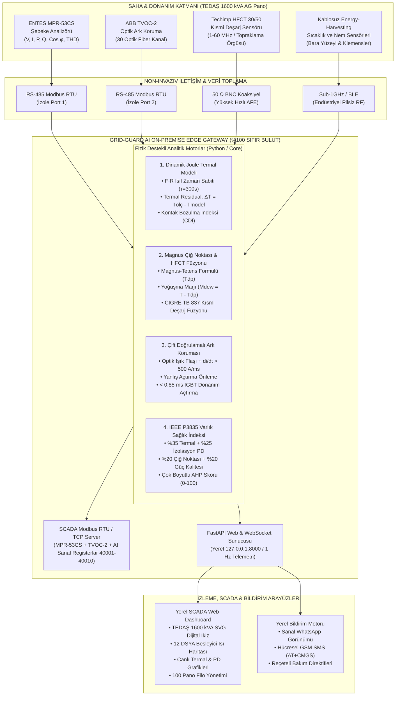

# GRID-GUARD AI: SİSTEM VE DONANIM MİMARİ ŞEMASI

Bu doküman, ADM & GDZ Elektrik Hackathonu sunumu ve video çekimi için projenin **Yazılım Sistem Mimarisi**, **Donanım / Sensör Entegrasyon Mimarisi** ve **Pano İçi Fiziksel Yerleşim Şemalarını** hem görsel Mermaid diyagramları hem de endüstriyel blok şemalar halinde sunar.

---

## 1. 🏗️ Genel Sistem ve Veri Akış Mimarisi (Software & Edge Architecture)



---

## 2. 🔌 Donanım Entegrasyon ve Sensör Yerleşim Şeması (Hardware Topology)

TEDAŞ 1600 kVA AG Panosu içinde **sıfır kablo karmaşası** ve **sıfır invaziv delme/kesme** prensibiyle sensörlerin yerleşimi:

```
┌────────────────────────────────────────────────────────────────────────────────────────┐
│               TEDAŞ 1600 kVA DAHİLİ AG DAĞITIM PANOSU (TEDAŞ-MLZ/2003-06.B)            │
│               Boyutlar: 1600 mm (Genişlik) x 1500 mm (Yükseklik) x 450 mm (Derinlik)    │
├───────────────────────────────────────────────────────────────────┬────────────────────┤
│ ÜST KOMPARTIMAN: KORUMA, ÖLÇÜ & SERVİS BÖLÜMÜ                     │ SAĞ HÜCRE (EÖ)     │
│                                                                   │                    │
│  ┌────────────────────────┐         ┌──────────────────────────┐  │ ┌────────────────┐ │
│  │ ABB TVOC-2 ARK MONİTÖRÜ│         │ GRID-GUARD AI GATEWAY    │  │ │ ENTES MPR-53CS │ │
│  │ 30 Optik Fiber Kanalı  │         │ Endüstriyel DIN-Ray Montaj│ │ │ Şebeke         │ │
│  │ IGBT Hızlı Açtırma     │         │ Çift Çekirdek 240 MHz    │  │ │ Analizörü      │ │
│  └───────────┬────────────┘         └────────────┬─────────────┘  │ └───────┬────────┘ │
│              │ (Dielektrik Fiberler)             │ (RS-485 Veri Yolu)       │          │
├──────────────┼───────────────────────────────────┼──────────────────────────┼──────────┤
│ ANA BARA BÖLMESİ: 3 Faz + Nötr [2 x (100 x 10 mm²) Elektrolitik Bakır]      │          │
│                                                                             │          │
│   L1 (R): ═════════════════════════════════════════════════════════════════ │          │
│   L2 (S): ═════════════════════════════════════════════════════════════════ │          │
│   L3 (T): ═════════════════════════════════════════════════════════════════ │          │
│                                                                             │          │
│   [Sensör Yerleşimi]:                                                       │          │
│    • TVOC-2 X1 Fiberleri (10 Nokta) ──▶ Ana Giriş Buşonları & Bara Dirsekleri          │
│    • Energy-Harvesting Klips Sensör ──▶ Pilsiz Manyetik İndüksiyon Sıcaklık Sensörü    │
├─────────────────────────────────────────────────────────────────────────────┼──────────┤
│ ÇIKIŞ BÖLMESİ: 12 Adet Dikey Sigortalı Yük Ayırıcı (DSYA NH-3 630A / NH-2 400A)        │
│                                                                                        │
│  ┌──────┐ ┌──────┐ ┌──────┐ ┌──────┐ ┌──────┐ ┌──────┐ ┌──────┐ ┌──────┐ ┌──────┐ ... │
│  │DSYA01│ │DSYA02│ │DSYA03│ │DSYA04│ │DSYA05│ │DSYA06│ │DSYA07│ │DSYA08│ │DSYA09│     │
│  │      │ │      │ │      │ │ ⚠️   │ │      │ │      │ │      │ │      │ │      │     │
│  │Klem. │ │Klem. │ │Klem. │ │Klem. │ │Klem. │ │Klem. │ │Klem. │ │Klem. │ │Klem. │     │
│  │Sensör│ │Sensör│ │Sensör│ │Sensör│ │Sensör│ │Sensör│ │Sensör│ │Sensör│ │Sensör│     │
│  └──────┘ └──────┘ └──────┘ └──────┘ └──────┘ └──────┘ └──────┘ └──────┘ └──────┘     │
│  * Her DSYA çıkış pabucuna kablosuz RF sıcaklık düğümü (Cıvata gevşemesi tespiti)      │
│  * TVOC-2 X2 Fiberleri ──▶ DSYA sigorta bıçak aralıklarına doğrudan bakar               │
├────────────────────────────────────────────────────────────────────────────────────────┤
│ ALT KABLO GİRİŞ / ÇIKIŞ & TOPRAKLAMA BÖLGESİ                                           │
│                                                                                        │
│        [Kablo Başlıkları Topraklama Örgüsü / Earth Return]                             │
│                  │                                                                     │
│             ┌────┴────────────────────────┐                                            │
│             │  TECHIMP HFCT 30/50         │ (Kelepçe Tipi Klips Montaj)                │
│             │  Kısmi Deşarj (PD) Sensörü  │ (SIFIR KESİNTİ - Canlı Baraya Dokunmaz)     │
│             └────────────┬────────────────┘                                            │
│                          │ (50 Ohm RG-58 BNC Koaksiyel)                                │
│                          └──────────────────────────────▶ [Gateway Hızlı AFE Girişi]   │
└────────────────────────────────────────────────────────────────────────────────────────┘
```

---

## 3. ⏱️ Çok Katmanlı Erken Uyarı Zaman Çizelgesi (Time-to-Fault)

Grid-Guard AI fizik motorlarının arıza modlarına göre koruma ve erken uyarı hiyerarşisi:

```
ZAMAN ÖLÇEĞİ:
|<------------- HAFTALAR / AYLAR ÖNCESİ ------------->|<--- GÜNLER / SAATLER --->|<-- <1 ms -->|

1. TERMAL RESIDUAL (JOULE İZLEME)
   Cıvata Gevşemesi -> Direnç Artışı (ΔT > +15°C, CDI > 1.5x)
   [Erken Torklama Reçetesi & Planlı Bakım]
   ---------------------------------------------------->

2. KONDENZASYON & HFCT PD FÜZYONU
   Nem > %90 + Marj < 3°C + HFCT > 40 pps
   [İzolasyon Yüzey Atlama / Bozulma Uyarısı]
   --------------------------------------------------------------------------->

3. ABB TVOC-2 & ÇİFT KRİTERLİ ARK KORUMA
   Işık Flaşı + di/dt > 500 A/ms
   [Donanımsal IGBT Kesici Açtırma: < 0.85 ms]
   ------------------------------------------------------------------------------------------->|
```

---

## 4. 📁 Proje İçindeki İlgili Mimari Dokümanlar

| Doküman | Yol | Kapsam |
| :--- | :--- | :--- |
| **Donanım & Elektronik Tasarım** | [`docs/HARDWARE_DESIGN.md`](file:///c:/Users/Userr/Projects/grzhackhathon/docs/HARDWARE_DESIGN.md) | Sensör montajı, kablosuz düğümler, PCB blok şeması, BOM maliyet tablosu |
| **Akademik & Algoritma Teorisi** | [`docs/ALGORITHM_THEORY.md`](file:///c:/Users/Userr/Projects/grzhackhathon/docs/ALGORITHM_THEORY.md) | Joule $I^2 R$, Magnus denklemi, TVOC-2 çift kriter, AHP Sağlık İndeksi |
| **Yazılım Mimarisi & Başlangıç** | [`README.md`](file:///c:/Users/Userr/Projects/grzhackhathon/README.md) | FastAPI, WebSocket, 4 senaryo ve veri akış kutuları |
| **Modbus SCADA Register Haritası** | [`docs/SCADA_MODBUS_MAPPING.md`](file:///c:/Users/Userr/Projects/grzhackhathon/docs/SCADA_MODBUS_MAPPING.md) | ENTES MPR-53CS + ABB TVOC-2 + Grid-Guard AI (40001-40010) register tablosu |
| **Video Konuşma Metni** | [`video_konusma_metni.md`](file:///C:/Users/Userr/.gemini/antigravity/brain/f13ff0a6-2214-4f33-8f3c-626ab5e962f3/video_konusma_metni.md) | 5 dakikalık eksiksiz video sunum rehberi |
